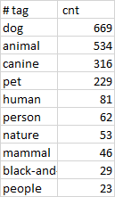

# Dummy API project 
This script store's data from a dummy API https://dummyapi.io/docs into a MySQL database.

---
**Important note**: Change the configurations' info in db_connection/connection_info.py file before running this script.

- hostname
- username
- password
- dbname default value ("dummyApi")

---
### Data Analysis with MySQL 

Once the Python script is completed, test the data with the queries in *data_analysis_queries.sql* file.

For example in the question "*Which tags are most frequently encountered, across user posts?*", the following are the top 10 results.

---

### Orchestration & Monitoring

For ease deploying to production we could create a docker image with the application.

To go one step further, with some changes in the code we could enhance this application by using Google's platform's tools Cloud Composer (Apache Airflow) for the orchestration, Big Query as the data warehouse, and Data Studio for creating a dashboard with some insights. 

ETL Overview using Airflow:
1. Read the data using the api, and clean and transform the data. Return the new dataframes (users, posts, comments ).
2. Loading data into BigQuery. Receive the dataframes as input and load the data using google.cloud bigquery package.
3. Use BigQueryCheckOperator to run some queries in Big Query to check the results. 
4. Use Data Studio to create dashboards with insides and data analysis, using Big Query tables created in the previews step. 

Orchestrate this creating a DAG for Airflow (Cloud Composer) with the python scripts describe in step 1 - 3.